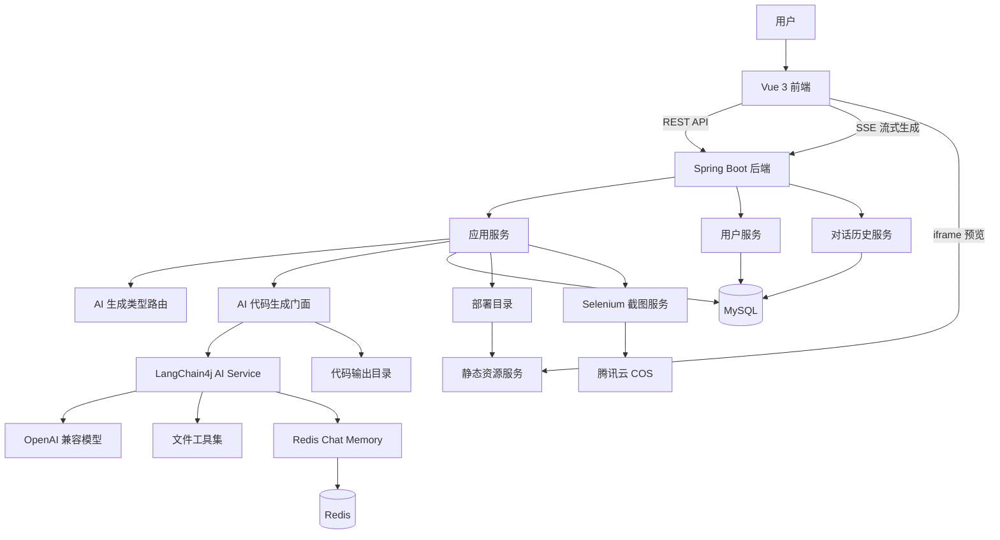

<div align="center">

# AI Code Mom

**AI 零代码应用生成平台**

用自然语言描述需求，AI 自动生成、预览、迭代、下载并部署 Web 应用。

[](https://openjdk.org/)
[](https://spring.io/projects/spring-boot)
[](https://vuejs.org/)
[](https://www.typescriptlang.org/)
[](https://docs.langchain4j.dev/)
[](https://www.mysql.com/)
[](https://redis.io/)

[在线体验](http://110.42.141.105) · [接口文档](http://110.42.141.105/api/doc.html) · [GitHub 仓库](https://github.com/nanfei892/ai-code-mom)

</div>

---

## 项目简介

AI Code Mom 是一个面向 C 端用户的 **AI 零代码应用生成平台**。用户输入一句应用需求，例如「帮我做一个个人博客」或「生成一个任务管理工具」，系统会自动创建应用、选择合适的代码生成模式，并通过流式对话生成可运行的 Web 项目。

平台支持 **HTML 单文件、多文件静态站、Vue 工程** 三种生成模式，生成后可在浏览器中实时预览，并支持一键部署、代码下载、应用精选、对话历史、后台管理等完整产品能力。

这个项目已经完成线上部署并开源，适合作为 **Java 全栈开发、AI 应用开发、工程化落地能力** 的项目展示。

---

## 在线地址

| 类型 | 地址 |
| --- | --- |
| 在线体验 | [http://110.42.141.105](http://110.42.141.105) |
| 后端接口 | `http://110.42.141.105/api` |
| 接口文档 | [http://110.42.141.105/api/doc.html](http://110.42.141.105/api/doc.html) |
| 开源仓库 | [https://github.com/nanfei892/ai-code-mom](https://github.com/nanfei892/ai-code-mom) |

---

## 核心功能

| 功能 | 说明 |
| --- | --- |
| AI 应用生成 | 用户输入自然语言需求，AI 自动生成可运行 Web 应用 |
| 智能模式路由 | 创建应用时自动选择 HTML、多文件或 Vue 工程生成模式 |
| 流式对话生成 | 基于 SSE 实时展示 AI 输出过程，减少等待黑盒感 |
| 实时应用预览 | 生成完成后在页面右侧 iframe 中即时预览运行效果 |
| 多轮迭代修改 | 保存对话历史和上下文，支持继续让 AI 修改已有应用 |
| Vue 工程生成 | 通过 LangChain4j Tools 读写文件，生成完整 Vue 项目并构建 |
| 可视化编辑辅助 | 预览区可选择页面元素，将元素信息带入下一轮修改提示词 |
| 一键部署 | 将生成应用发布到公网访问地址，并自动生成应用封面 |
| 代码下载 | 应用创建者可下载生成代码压缩包 |
| 精选应用广场 | 展示优质应用，支持应用列表分页和详情查看 |
| 用户体系 | 支持注册、登录、会话保持、用户角色和权限校验 |
| 管理后台 | 支持用户、应用、对话历史等后台管理能力 |
| 限流保护 | 基于 Redisson 对 AI 生成接口做用户级限流 |
| 工作流实验 | 集成 LangGraph4j，探索素材收集、提示词增强、质量检查等节点化流程 |

---

## 项目亮点

### 1. 多生成模式自动路由

系统不是固定用一种方式生成代码，而是在创建应用时根据用户初始需求，通过独立的 AI 路由服务选择生成类型：

- `html`：适合单页活动页、展示页、轻量页面
- `multi_file`：适合结构清晰的静态站点，拆分 HTML / CSS / JS
- `vue_project`：适合复杂交互、多页面、组件化应用

这样可以在生成速度、代码结构和应用复杂度之间取得更好的平衡。

### 2. SSE 流式生成体验

后端通过 Reactor `Flux` + `ServerSentEvent` 输出 AI 生成内容，前端通过 `EventSource` 实时接收并展示生成过程。用户不需要等待完整结果返回，就能看到 AI 正在生成什么。

### 3. LangChain4j Agent 工程化实践

Vue 工程模式下，AI 不只是返回一段文本，而是通过工具调用完成文件级操作：

- 读取目录和文件
- 创建、修改、删除文件
- 多轮工具调用搭建工程结构
- 生成完成后自动执行构建

项目中还为不同应用维护独立对话记忆，避免多个应用之间上下文串扰。

### 4. 从生成到部署的完整闭环

平台覆盖了 AI 应用生成的完整链路：

```text
输入需求 -> 创建应用 -> AI 生成代码 -> 实时预览 -> 多轮修改 -> 下载代码 -> 一键部署 -> 自动截图封面
```

这不是一个单纯的 Demo，而是包含用户、权限、存储、限流、部署、后台管理的完整 Web 产品。

---

## 系统架构



---

## 技术栈

### 后端

| 技术 | 用途 |
| --- | --- |
| Java 21 | 后端主要开发语言 |
| Spring Boot 3.5 | Web 服务、配置管理、依赖注入 |
| MyBatis-Flex | ORM、分页查询、条件构造 |
| MySQL | 用户、应用、对话历史等业务数据存储 |
| Redis / Spring Session | 登录态、会话、AI 对话记忆 |
| LangChain4j | AI 服务编排、流式模型、工具调用、Chat Memory |
| LangGraph4j | 工作流式 AI 代码生成实验 |
| Reactor | 流式响应处理 |
| Redisson | 分布式限流 |
| Caffeine | AI 服务实例本地缓存 |
| Knife4j | 后端接口文档 |
| Selenium | 应用部署后自动截图 |
| 腾讯云 COS | 应用封面等对象存储 |

### 前端

| 技术 | 用途 |
| --- | --- |
| Vue 3 | 前端框架 |
| TypeScript | 类型约束 |
| Vite | 前端构建工具 |
| Ant Design Vue | UI 组件库 |
| Pinia | 登录用户状态管理 |
| Vue Router | 页面路由 |
| Axios | HTTP 请求 |
| EventSource | SSE 流式消息接收 |
| Markdown-it / Highlight.js | AI 回复 Markdown 渲染和代码高亮 |

---

## 代码生成模式

| 模式 | 枚举值 | 生成结果 | 适用场景 |
| --- | --- | --- | --- |
| HTML 单文件 | `html` | `index.html` | 简单页面、落地页、展示页 |
| 多文件静态站 | `multi_file` | `index.html`、`style.css`、`script.js` | 结构更清晰的静态应用 |
| Vue 工程 | `vue_project` | 完整 Vue 项目源码和 `dist` 构建产物 | 多页面、组件化、复杂交互应用 |

---

## 项目结构

```text
ai-code-mom/
├── ai-code-mom-frontend/          # Vue 3 前端项目
│   ├── src/api/                   # OpenAPI 生成的接口请求
│   ├── src/components/            # 通用组件
│   ├── src/pages/                 # 页面：主页、对话页、管理页、登录注册等
│   ├── src/router/                # 前端路由
│   ├── src/stores/                # Pinia 状态
│   └── src/utils/                 # 工具方法
├── sql/
│   └── create_table.sql           # 数据库初始化脚本
├── src/main/java/com/zsm/aicodemom/
│   ├── ai/                        # LangChain4j AI 服务、路由、工具、护轨
│   ├── annotation/                # 权限注解
│   ├── aop/                       # 权限拦截切面
│   ├── config/                    # Redis、CORS、模型、COS 等配置
│   ├── controller/                # 用户、应用、对话、静态资源接口
│   ├── core/                      # 代码生成门面、解析器、保存器、Vue 构建器
│   ├── langgraph4j/               # LangGraph4j 工作流实验模块
│   ├── manager/                   # COS 管理器
│   ├── mapper/                    # MyBatis-Flex Mapper
│   ├── model/                     # DTO、VO、实体、枚举
│   ├── ratelimit/                 # Redisson 限流注解与切面
│   └── service/                   # 业务服务
├── src/main/resources/
│   ├── mapper/                    # XML 映射文件
│   ├── prompt/                    # AI 系统提示词
│   └── application.yml            # 基础配置
├── pom.xml                        # 后端 Maven 配置
└── README.md
```

---

## 核心流程

### 创建应用

```text
用户输入初始化 Prompt
    -> AppController.addApp()
    -> AppService.createApp()
    -> AiCodeGenTypeRoutingService 选择生成模式
    -> 应用信息写入 MySQL
    -> 返回 appId
```

### 对话生成代码

```text
前端 EventSource 请求 /api/app/chat/gen/code
    -> 后端校验登录态和应用归属
    -> 保存用户消息到 chat_history
    -> AiCodeGeneratorFacade 根据 codeGenType 分发
    -> LangChain4j 流式生成代码
    -> 解析并保存文件到 code_output
    -> 保存 AI 回复到 chat_history
    -> 前端刷新预览 iframe
```

### 部署应用

```text
用户点击部署
    -> 校验应用归属
    -> 检查生成目录
    -> Vue 项目执行构建并部署 dist
    -> 静态文件复制到部署目录
    -> 生成 deployKey 和访问地址
    -> 虚拟线程异步截图
    -> 上传封面到 COS
```

---

## 快速开始

### 环境要求

| 依赖 | 建议版本 |
| --- | --- |
| JDK | 21+ |
| Maven | 3.9+ |
| Node.js | 18+ |
| npm | 9+ |
| MySQL | 8.0+ |
| Redis | 6.0+ |

### 1. 克隆项目

```bash
git clone https://github.com/nanfei892/ai-code-mom.git
cd ai-code-mom
```

### 2. 初始化数据库

```bash
mysql -u root -p < sql/create_table.sql
```

### 3. 配置后端

建议新建本地配置文件，并通过 Spring Profile 加载，不要把真实密钥提交到仓库。

```yaml
spring:
  datasource:
    url: jdbc:mysql://localhost:3306/ai_code_mom
    username: your_mysql_username
    password: your_mysql_password
  data:
    redis:
      host: localhost
      port: 6379

langchain4j:
  open-ai:
    chat-model:
      api-key: your_api_key
      base-url: your_model_base_url
    streaming-chat-model:
      api-key: your_api_key
      base-url: your_model_base_url
```

启动后端：

```bash
./mvnw spring-boot:run
```

默认后端地址：

```text
http://localhost:8123/api
```

接口文档：

```text
http://localhost:8123/api/doc.html
```

### 4. 启动前端

```bash
cd ai-code-mom-frontend
npm install
npm run dev
```

前端环境变量示例：

```env
VITE_API_BASE_URL=http://localhost:8123/api
VITE_DEPLOY_DOMAIN=http://localhost
```

默认前端地址：

```text
http://localhost:5173
```

---

## API 概览

| 模块 | 主要接口 |
| --- | --- |
| 健康检查 | `GET /api/health/` |
| 用户 | 注册、登录、退出登录、获取当前用户 |
| 应用 | 创建、删除、更新、详情、分页、精选列表 |
| AI 生成 | `GET /api/app/chat/gen/code` |
| 部署 | `POST /api/app/deploy` |
| 下载 | `GET /api/app/download/{appId}` |
| 对话历史 | 应用对话历史分页查询 |
| 工作流实验 | `/api/workflow/execute`、`/api/workflow/execute-flux`、`/api/workflow/execute-sse` |

完整接口参数可查看 Knife4j 文档。

---

## 数据库设计

| 表 | 说明 |
| --- | --- |
| `user` | 用户账号、密码、头像、角色等信息 |
| `app` | 应用名称、封面、初始化 Prompt、生成类型、部署标识等 |
| `chat_history` | 用户和 AI 的对话历史，支持按应用分页查询 |

---

## 简历项目亮点

如果将该项目写入简历，可以突出以下能力：

- 独立完成 AI 零代码应用生成平台，从需求输入到代码生成、预览、部署形成完整闭环。
- 基于 Spring Boot + Vue 3 构建前后端分离应用，包含用户体系、权限校验、管理后台和接口文档。
- 深度使用 LangChain4j，实现流式对话、工具调用、对话记忆、提示词护轨和多模型配置。
- 设计多模式代码生成策略，支持 HTML、多文件静态站、Vue 工程，并通过 AI 自动路由生成类型。
- 使用 SSE 优化 AI 生成体验，让用户实时感知生成过程。
- 使用 Redis、Redisson、Caffeine 提升系统稳定性，完成会话存储、限流保护和实例缓存。
- 实现一键部署、代码下载、自动截图上传 COS 等产品化能力。
- 探索 LangGraph4j 工作流，将素材收集、提示词增强、代码生成、质量检查等步骤节点化。

---

## 后续规划

- [ ] 增加项目演示截图和生成效果 GIF
- [ ] 完善 README 中的部署架构图和线上 Nginx 配置说明
- [ ] 支持更多前端技术栈生成，如 React、UniApp、小程序
- [ ] 增强 Vue 工程生成后的自动检测、修复和测试能力
- [ ] 将 LangGraph4j 工作流与主生成链路进一步融合
- [ ] 增加应用模板市场和用户公开分享能力

---

## 作者

**nanfei892**

- GitHub：[@nanfei892](https://github.com/nanfei892)
- 邮箱：nanfei892@gmail.com

如果这个项目对你有帮助，欢迎 Star。

---

## License

当前仓库暂未补充开源协议文件。如需正式开源分发，建议添加 `LICENSE` 文件。
